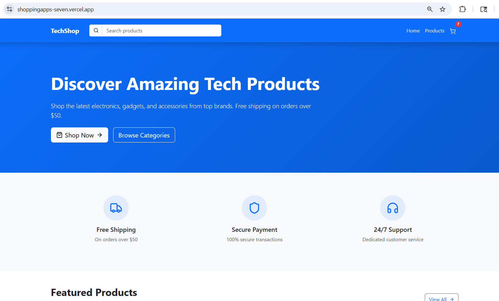
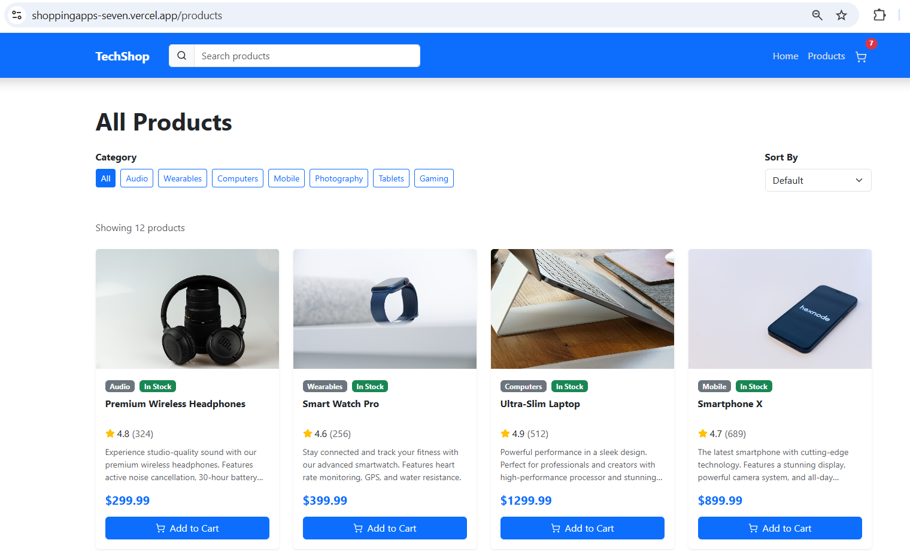
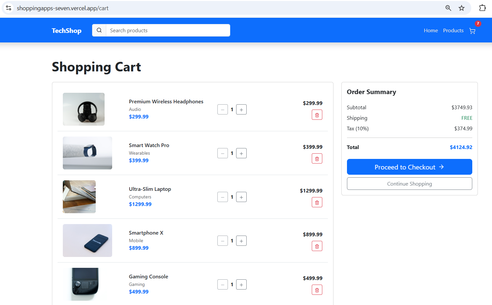

#  TechShop E-Commerce Shopping App

A fully responsive and modern **frontend e-commerce web application** built with **Vite, React, JavaScript, and Bootstrap**.  
TechShop delivers a smooth shopping experience with global search, cart management, product filtering, and a clean UI inspired by real-world ecommerce platforms.

---

## 🌐 Live Demo

👉 [View Live Project](https://shoppingapps-seven.vercel.app/)

---

## ✨ Features

-  **Global Search** with live suggestions
-  Debounced search for optimized performance
-  Product filtering by category
-  Sorting (price, rating, name)
-  Cart system with quantity management 
-  Fully responsive UI (mobile, desktop)
-  Clean UX with modern ecommerce layout
-  Context API for state management
---

## 🛠️ Tech Stack
 React, 
 JavaScript, 
 Bootstrap, 
 Vite

---

## 📸 Screenshots

### 🏠 Home Page

---

### 🛍️ Product Page

---

### 🛒 Cart Page 

---